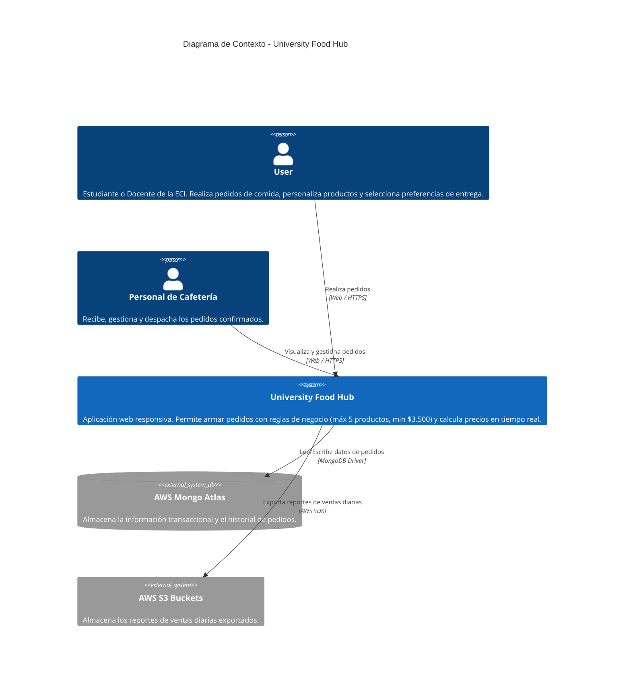

# Diagrama de Contexto - University Food Hub

A continuación se presenta el diagrama de contexto (Nivel 0) para el sistema **University Food Hub**, utilizando la notación C4 con Mermaid.

Este diagrama ilustra las interacciones principales entre los actores (User y el Personal de la Cafetería), el sistema principal y los sistemas externos (AWS Mongo Atlas y AWS S3).

## Generalidades Identificadas:
*   **Usuarios principales:** User (puede ser estudiante o docente) que interactúa a través de dispositivos móviles, tablets o computadoras de escritorio.
*   **Sistema Central (University Food Hub):** Encargado de la lógica de negocio como la validación de un máximo de 5 productos, precio mínimo de $3.500, cálculo en tiempo real y tiempos de respuesta de $\le 1.5$ s bajo la carga de hasta 300 pedidos simultáneos.
*   **Dependencias de Almacenamiento:**
    *   **AWS Mongo Atlas:** Persistencia en base de datos NoSQL para los pedidos.
    *   **AWS S3 Buckets:** Almacenamiento de archivos para los reportes de ventas diarias.
