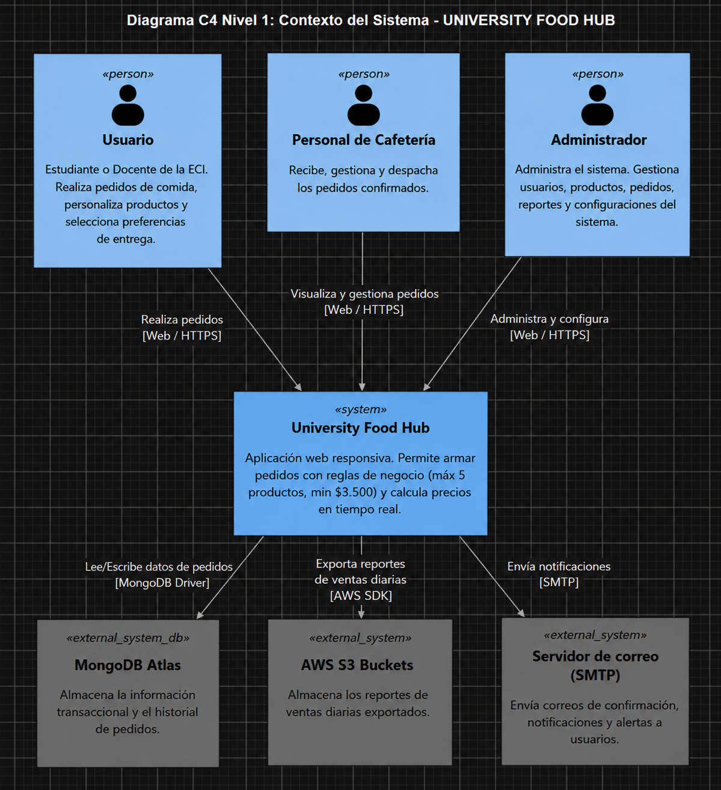
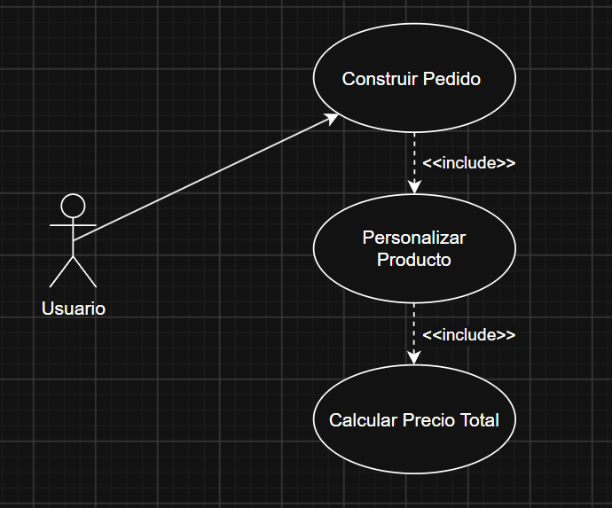
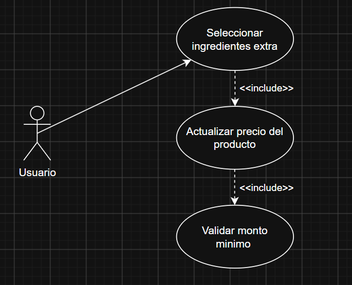
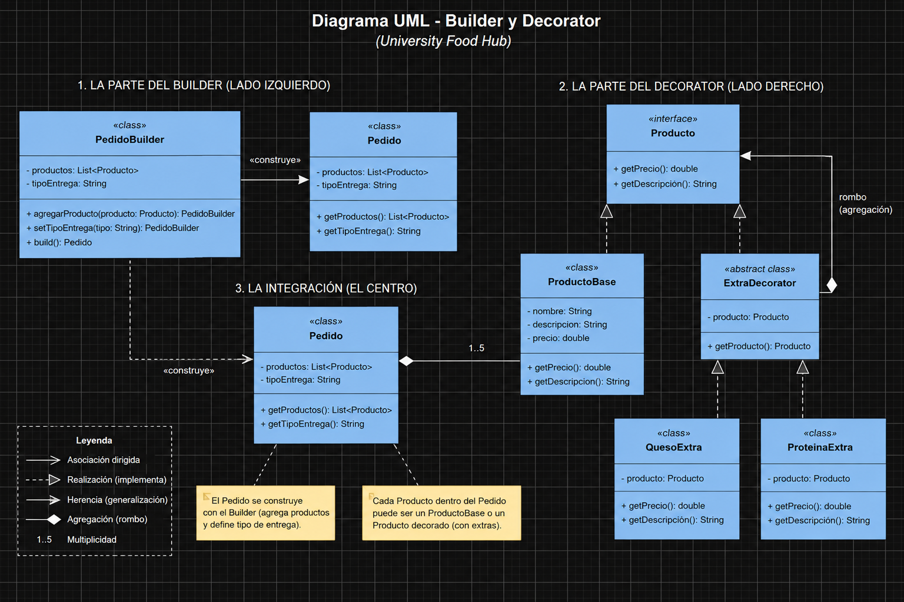
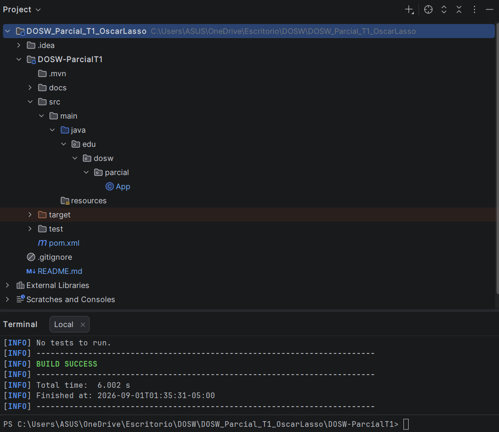

# DOSW_Parcial_T1_OscarLasso

Oscar David Lasso Martinez 
DOSW - 1

# 1 Diagrama de Contexto

# 2 Requerimientos 

Funcionales:
- Construir un pedido complejo seleccionando producto base, extras y tipo de entrega
- Calcular el precio final del producto sumando dinamicamente todos los costos del pedido
- Registrar los pedidos confirmados de la cafetería en la base de datos AWS Mongo Atlas.

No funcionales:
- Mostrar la interfaz web usando tipografia Poppins y Colores Azul y Dorado
- Responder a las peticiones del sistema en 1.5 segundos o menos para el 90% de los casos

# 3 Casos de uso

Requerimientos funcionales mas importantes:
- Construir un pedido complejo seleccionando producto base, extras y tipo de entrega (Builder)
- Calcular el precio final del producto sumando dinamicamente todos los costos del pedido (Decorator)

### Diagrama de Casos de Uso

### Historias de Usuario

**Historia de Usuario 1: Construcción de Pedido**

* **Requerimiento asociado:** RF1 - Construir un pedido complejo.
* **Patrón aplicado:** Builder.

* **Como** usuario 
* **Quiero** poder armar mi pedido paso a paso, escogiendo los productos base, añadiendo opciones extras y definiendo el método de entrega
* **Para** asegurar que mi comida sea preparada exactamente como la deseo antes de enviarla a la cafetería.
* **Criterios de Aceptación:**
    1. El usuario puede agregar un máximo de 5 productos por pedido.
    2. Es obligatorio seleccionar un método de entrega antes de finalizar.
    3. El pedido se construye secuencialmente y no se procesa hasta confirmar todos los datos.

**Historia de Usuario 2: Cálculo Dinámico de Precios**

* **Requerimiento asociado:** RF2 - Calcular el precio final dinámicamente.
* **Patrón aplicado:** Decorator.

* **Como** usuario
* **Quiero** que el precio de cada producto se actualice automáticamente a medida que selecciono ingredientes extras
* **Para** tener total transparencia sobre el costo final de mi pedido antes del pago.
* **Criterios de Aceptación:**
    1. El sistema inicia con el precio base del producto seleccionado.
    2. Cada ingrediente extra seleccionado suma su costo respectivo al total del producto.
    3. El sistema valida que el total del pedido alcance el mínimo de $3.500 para permitir la confirmación.

# 4 Analisis de requerimientos
carpeta docs/requirements

# 5 Descomposición de Tareas

**Requerimiento seleccionado:** RF1 - Construir un pedido complejo 

* **Épica:** UNIVERSITY FOOD HUB
* **Feature:** Creación y personalización de pedidos
* **Historia de Usuario:** Historia de Usuario 1 (Construcción de Pedido)
* **Tareas (Tasks):**
  1. **Tarea 1 (Frontend):** Diseñar y desarrollar la interfaz de usuario para permitir la selección secuencial de productos, extras y métodos de entrega.
  2. **Tarea 2 (Backend - Builder):** Implementar la clase `PedidoBuilder` y su lógica para construir el objeto Pedido paso a paso, garantizando la restricción de máximo 5 productos por pedido.
  3. **Tarea 3 (Validación):** Implementar la validación final que exija obligatoriamente definir el método de entrega antes de procesar y confirmar el pedido.

# 6 Patrones Asignados y Justificación

### 6.1 Patrón: Builder
**a. Tipo:** Creacional
**b. Justificación en UNIVERSITY FOOD HUB:** 
Un pedido puede componerse de múltiples productos distintos (hasta 5) y requiere información obligatoria como la preferencia de entrega. El patrón Builder permite construir este objeto complejo paso a paso de forma limpia, separando la lógica de construcción de la representación final del pedido, y evitando constructores gigantescos (telescoping constructor).
**d. Principios SOLID aplicados:**
*   **Single Responsibility Principle (SRP):** La clase `Pedido` solo representa la información, mientras que la responsabilidad exclusiva de construirlo y validarlo recae en `PedidoBuilder`.
*   **Open/Closed Principle (OCP):** Si en el futuro se agregan nuevos pasos para construir un pedido (ej. método de pago), se extiende el Builder sin modificar la entidad `Pedido`.

### 6.2 Patrón: Decorator
**a. Tipo:** Estructural
**b. Justificación en UNIVERSITY FOOD HUB:** 
Los productos base (Sándwich, Ensalada, etc.) pueden ser personalizados con múltiples ingredientes extras (Queso, Proteína, Aguacate). El patrón Decorator permite añadir estas características y costos dinámicamente en tiempo de ejecución, evitando crear una infinidad de subclases estáticas (ej. `SandwichConQueso`, `SandwichConQuesoYProteina`).
**d. Principios SOLID aplicados:**
*   **Open/Closed Principle (OCP):** Podemos añadir nuevos ingredientes extras al menú creando nuevos decoradores, sin modificar el código de los productos base ni de los decoradores existentes.
*   **Single Responsibility Principle (SRP):** Cada decorador (ingrediente) tiene la única responsabilidad de sumar su propio costo y nombre, dejando al producto base con su comportamiento original.

### 6.3 Diagrama de Clases UML (Builder + Decorator)

link bitacora:
https://github.com/Oscar10lm/Bitacora.git

# Maven

---
# Draw.io

---
# Figma

